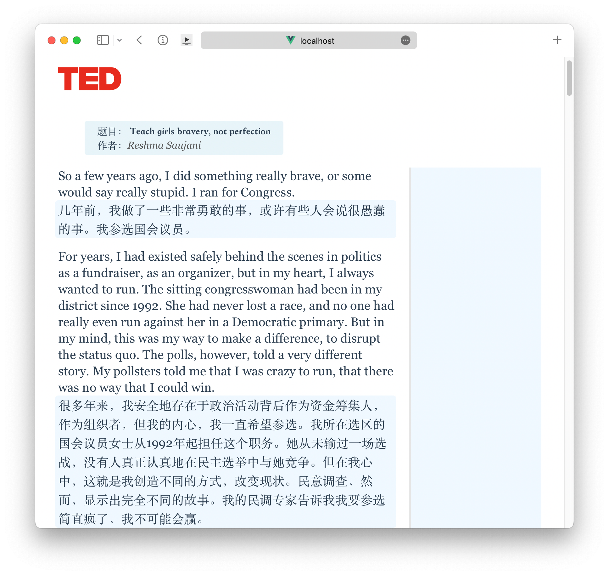
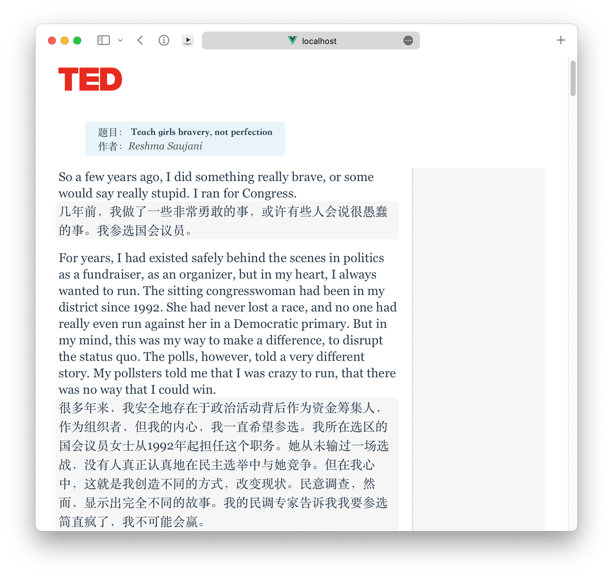
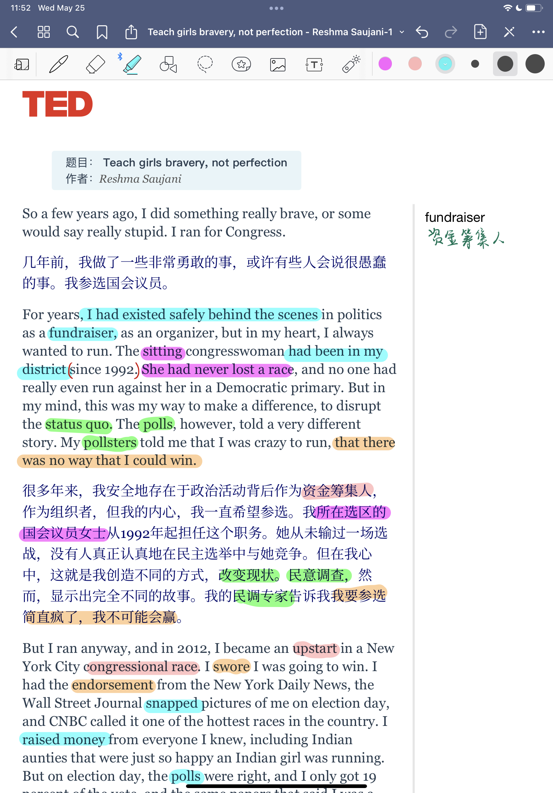

# Ted-talk Exporter

> `Ted-talk Exporter` enables you to automatically export TED talks from `url` to a readable bilingual format.

> application deployed on Vercel, Live Demo: [https://tedtalk.vercel.app/](https://tedtalk.vercel.app/)

Switch background by simply clicking on it.

`export` in safari and share it to note-taking apps on the iPad and, do your annotation.

## More `customization` is coming soon!

- [ ] popover menu
- [ ] delete paragraph
- [ ] custom fonts/colors/size and more
- [ ] more sources
